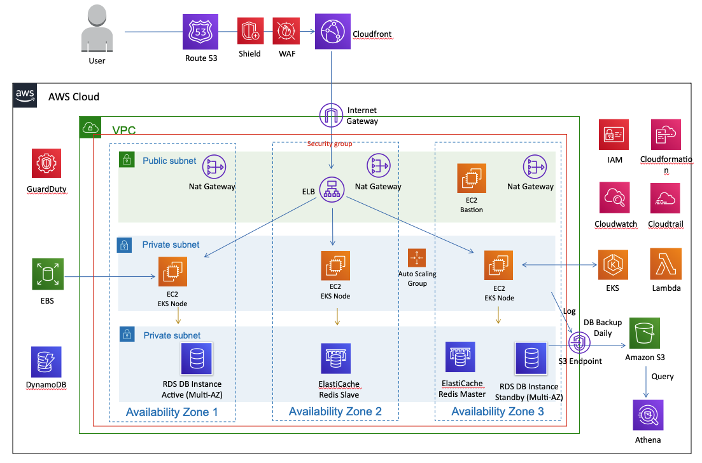

# workshop-eks

## AWS Reference Architecture

## 1. [Login to AWS Console](1.login-to-aws-console.md)

## 2. [Install tools for EKS](2.install-tools-for-eks.md)

## 3. [Create EKS nodegroup](3.create-eks-nodegroup.md)

## 4. [Docker Image Build](4.docker-image-build.md)

## 5. [Deploy K8S APP Deployment and Service](5.deploy-k8s-app-service.md)

## 6. [AWS load balancer controller](6.create-aws-load-balancer-controller.md)

## 7. [Prometheus and Grafana Monitoring EKS](7.monitor-eks-with-prometheus-grafana.md)

## 8. [Create service account for pod](8.create-service-account-for-pod.md)

## 9. [Fluentbit Logs](9.fluent-bit-logs.md)

## 10. [Scale pod and node](10.scale-pod-and-node.md)

